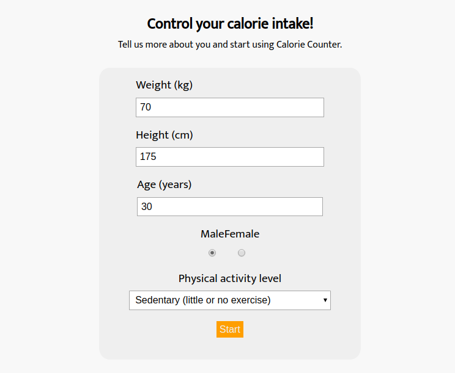
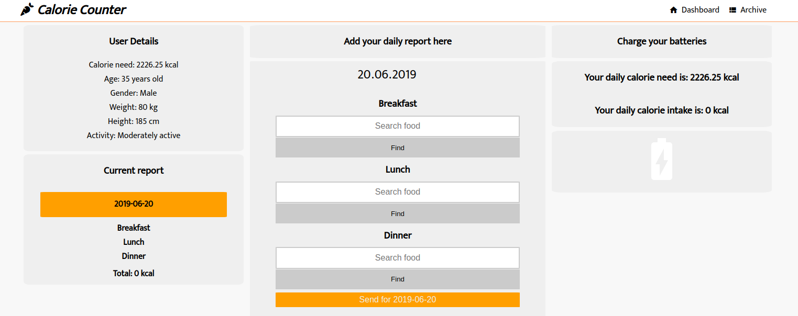
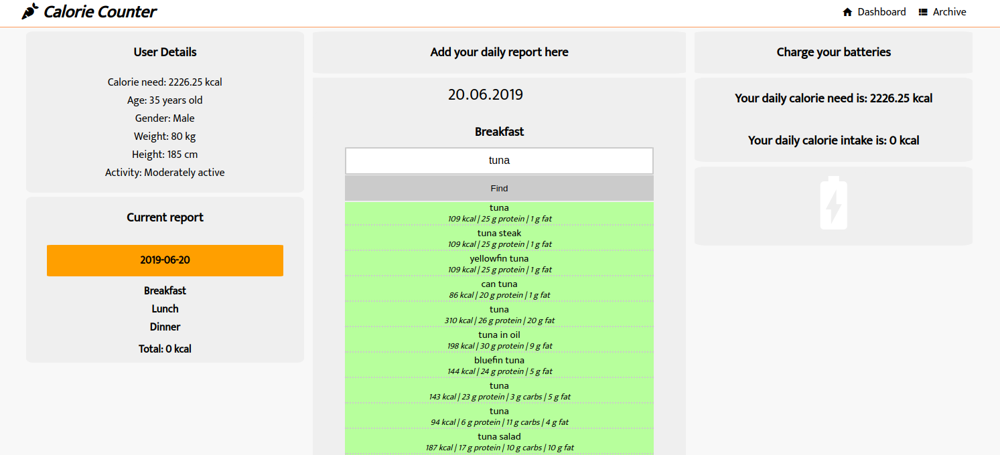
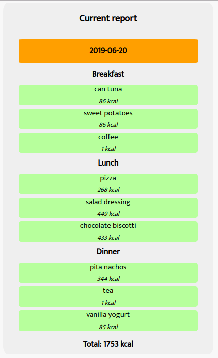
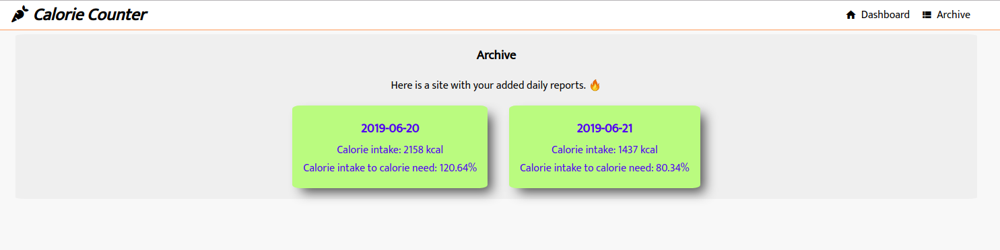
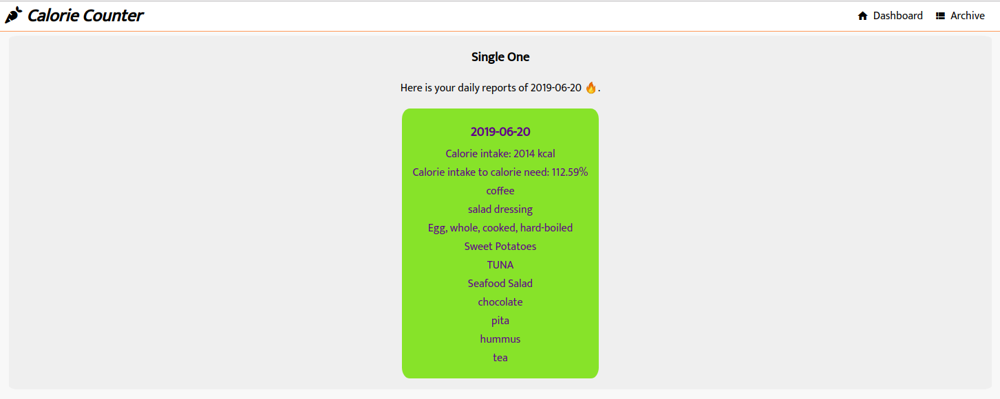

# Calorie Counter ReactJS
Calorie counter created with &#x2665; and React JS.
The project was created during front-end bootcamp - CodersLab (based in Warsaw).

## Technologies used for this project
* [Sass](https://sass-lang.com/)
* [React (ReactDOM, React-Router)](https://reactjs.org/)

## Configuration

In order to run this project you need to:
* Clone the repository
* Navigate to the directory where you have cloned the repo
* Install node modules using `npm install`
* Install webpack globally on your machine using `npm install --global webpack`
* Run `webpack`
* Open index.html in your favorite browser

## Functionalities
* Calculating daily calorie need (based on user input details)
* Searching food using external API
* Adding eaten products to a daily report
* Viewing archives of added daily reports
* Viewing charts of added daily reports (in progress)

### GitHub.pages
Visit the demo on github.pages: https://lukaszrej.github.io/Calorie-Counter_ReactJS/

### Page preview

